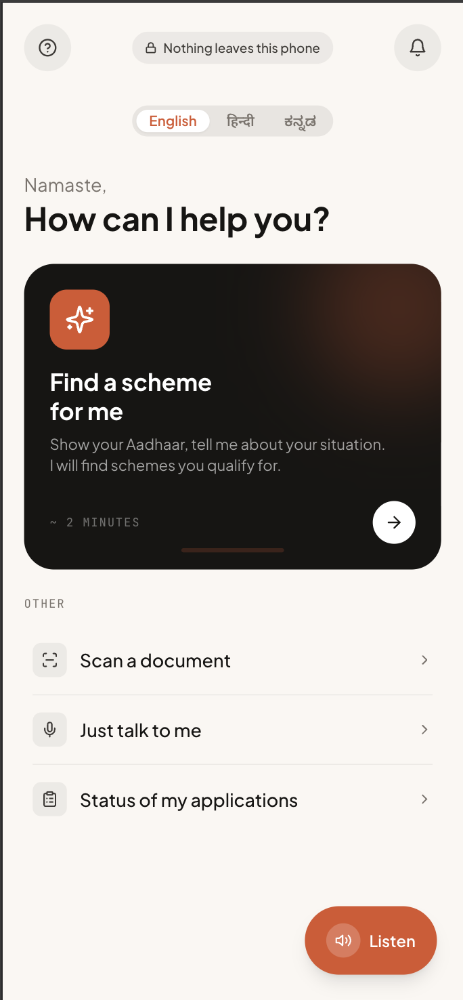
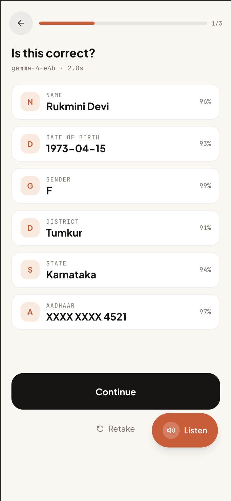
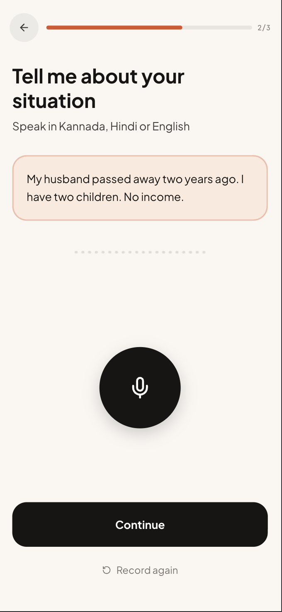
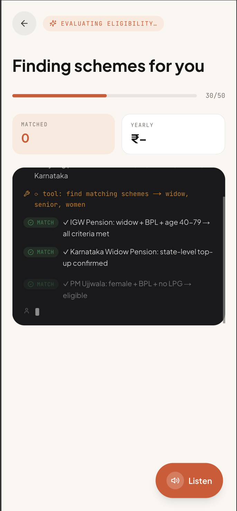
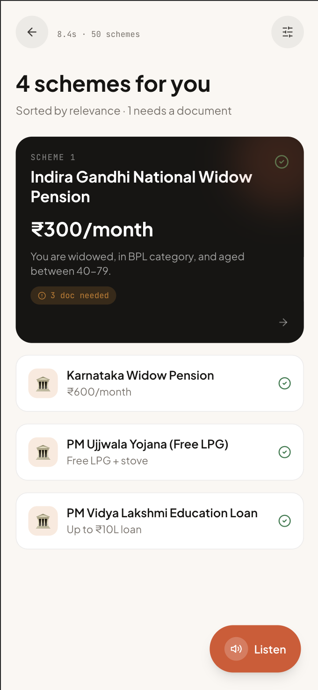
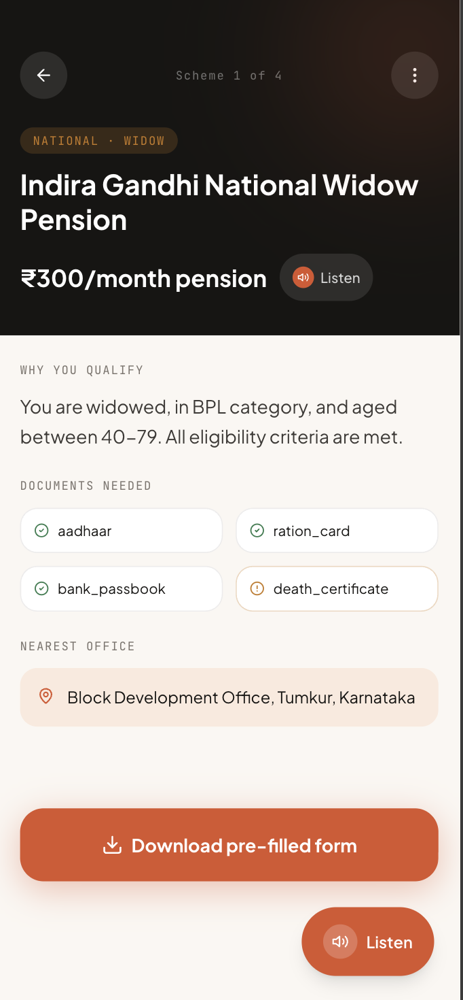

# SaralAI — Welfare Access Agent

> **Find every government scheme you qualify for — offline, in your language, in under two minutes.**
>
> Scan your Aadhaar card with your phone camera. Speak about your situation in Kannada, Hindi, or English. Get matched to schemes you qualify for, with a pre-filled PDF form ready to take to the office.
>
> Runs entirely on-device. Nothing leaves your phone. Powered by **Gemma 4 4B** via Ollama.

**[Watch the 2-minute demo](https://www.youtube.com/watch?v=kKwcawA3oeM)**

<table>
<tr>
<td align="center"><br/><sub><b>Home</b></sub></td>
<td align="center"><br/><sub><b>Scan Aadhaar</b></sub></td>
<td align="center"><br/><sub><b>Speak</b></sub></td>
<td align="center"><br/><sub><b>Gemma 4 Thinks</b></sub></td>
<td align="center"><br/><sub><b>Results</b></sub></td>
<td align="center"><br/><sub><b>Scheme Detail</b></sub></td>
</tr>
</table>

---

## Edge Optimization

SaralAI adapts automatically to whatever hardware it lands on — no configuration needed.

| Change | What it does |
|--------|-------------|
| **Adaptive memory config** (`memory_config.py`) | Auto-detects system RAM at startup and selects the right model variant (`e4b` vs `e2b`), context window (1024-8192), GPU offload level, and Whisper ASR size |
| **llama.cpp direct backend** (`llama_backend.py`) | Alternative to Ollama for edge devices. Loads GGUF model directly via `llama-cpp-python` with per-request context sizing, memory-mapped weights, flash attention, and dynamic GPU layer offloading |
| **Ollama memory guards** | Sets `OLLAMA_NUM_PARALLEL=1`, `OLLAMA_MAX_LOADED_MODELS=1`, `OLLAMA_FLASH_ATTENTION=1` automatically to prevent OOM on constrained devices |
| **3-tier hardware profiles** | **LOW** (8 GB): `gemma4:e2b`, 2048 ctx, CPU-only, Whisper tiny / **MEDIUM** (16 GB): `gemma4:e4b`, 4096 ctx, full GPU / **HIGH** (32 GB+): full model, 8192 ctx |
| **Performance telemetry** | llama.cpp backend logs tokens/sec, time-to-first-token, and peak RSS for every request |

### Hardware Tier Matrix

| Device | RAM | Model | Context Window | GPU Layers | Whisper | Backend |
|--------|-----|-------|---------------|------------|---------|---------|
| Raspberry Pi / Phone | 4-8 GB | gemma4:e2b (auto) | 1024 tokens | CPU only | tiny | llama.cpp |
| MacBook Air M2 | 8 GB | gemma4:e2b (auto) | 2048 tokens | CPU only | tiny | Ollama or llama.cpp |
| MacBook Pro M-series | 16 GB | gemma4:e4b | 4096 tokens | Full GPU | small | Ollama |
| Workstation / Desktop | 32 GB+ | gemma4:e4b | 8192 tokens | Full GPU | small | Ollama |

### llama.cpp Direct Backend

Set `SARALAI_BACKEND=llamacpp` to bypass Ollama entirely for maximum edge control:

- **Per-request context sizing** — OCR uses `n_ctx=512`, transcription uses `n_ctx=1024`, scheme matching uses `n_ctx=2048`
- **Memory-mapped model loading** — `use_mmap=True` lets the OS page model weights in and out of RAM
- **Flash attention** — `flash_attn=True` for O(1) memory attention instead of O(n^2)
- **Dynamic GPU layer offloading** — Calculates how many layers fit in VRAM, offloads the rest to CPU

```bash
# Edge setup
pip install llama-cpp-python
SARALAI_BACKEND=llamacpp LLAMACPP_MODEL_PATH=./gemma4-e2b.gguf ./start.sh
```

---

## The Problem

India has over 3,000 central and state welfare schemes — widow pensions, free LPG, housing subsidies, education loans — yet two-thirds of eligible citizens never access them. The barrier is not eligibility. It is language, literacy, and bureaucratic opacity.

A 52-year-old widow in rural Karnataka named Rukmini speaks only Kannada. She cannot read English eligibility criteria. She does not know which office processes her application. She has never filled a government PDF form. Her husband's death should have triggered Rs 900/month in combined central and state pension. Instead, she has received nothing for three years.

**SaralAI exists to close that gap.**

---

## How It Works

**Three steps. No typing. No English required.**

1. **Scan** — Point your phone camera at your Aadhaar card. Gemma 4's vision model reads it live — name, DOB, gender, district stream onto the screen as they're extracted.

2. **Speak** — Hold the mic button and describe your situation in Kannada or Hindi. *"My husband passed away two years ago. I have a BPL card."* Gemma 4 transcribes and understands in one pass.

3. **Match** — Gemma 4 runs an agentic tool-calling loop across 50 welfare schemes. Matched schemes stream to the screen with plain-language eligibility reasons. Tap any scheme to download a pre-filled PDF application form.

---

## Quickstart

### Prerequisites

| Tool | Version | Install |
|------|---------|---------|
| [Ollama](https://ollama.com/download) | latest | ollama.com/download |
| Python | 3.11+ | python.org |
| Node.js | 18+ | nodejs.org |

### Step 1 — Pull the model

```bash
ollama pull gemma4:e4b
```

### Step 2 — Start everything

#### Mac / Linux

```bash
cd saralai
chmod +x start.sh
./start.sh
```

#### Windows

```bat
start.bat
```

Or PowerShell: `pwsh start.ps1`

The script creates the venv, installs deps, seeds the database, starts both servers, and opens the browser automatically.

<details>
<summary>Manual setup (two terminals)</summary>

Terminal 1 — backend:
```bash
cd saralai/backend
python3 -m venv .venv
source .venv/bin/activate
pip install -r requirements.txt
python3 db/seed.py
uvicorn main:app --host 0.0.0.0 --port 8000 --reload
```

Terminal 2 — frontend:
```bash
cd saralai/frontend
npm install --legacy-peer-deps
npm run dev
```

Open **http://localhost:3000**
</details>

### Step 3 — Open on your phone (optional)

```bash
# Find your laptop's LAN IP:
ipconfig getifaddr en0       # Mac
ipconfig                     # Windows
ip addr show                 # Linux

# On your phone browser: http://<your-laptop-ip>:3000
# Tap browser menu -> "Add to Home Screen" to install as PWA
```

---

## Architecture

```
 Next.js 14 PWA (port 3000)
       |  HTTP + Server-Sent Events
       v
 FastAPI (port 8000)
  |-- /api/extract-doc      image -> field stream (SSE)
  |-- /api/transcribe       audio blob -> transcript
  |-- /api/find-schemes     profile + text -> scheme stream
  |-- /api/scheme/{id}      scheme detail
  |-- /api/generate-form    scheme + data -> PDF blob
  |-- /api/tts              text -> browser speech hint
       |              |              |
   Ollama          SQLite        ReportLab
   Gemma 4 4B      50 schemes    PDF forms
   (or llama.cpp)  25 natl       on-device
                   25 KA
```

**Data never leaves the machine.** All inference runs locally.

---

## What Gemma 4 Does

Gemma 4 4B handles three distinct tasks in this pipeline:

### 1. Vision OCR — `/api/extract-doc`
A JPEG of an Aadhaar card is sent directly to Gemma 4's vision encoder. A structured JSON extraction prompt returns name, date of birth, gender, district, state, and UID with field-level confidence scores. Fields are streamed to the UI via SSE as they arrive.

### 2. Multilingual ASR — `/api/transcribe`
The spoken narrative (WebM audio blob from MediaRecorder) is sent to Gemma 4. In a single pass it transcribes Kannada/Hindi/English speech and identifies welfare-relevant signals: widow status, BPL category, disability, land ownership.

### 3. Agentic Scheme Matching — `/api/find-schemes`
A custom tool-calling loop — built without LangChain, using OpenAI-compatible JSON schemas against Ollama — gives Gemma 4 four tools:

| Tool | What it does |
|------|-------------|
| `find_matching_schemes` | Queries SQLite with 11 predicate operators against the profile |
| `get_scheme_details` | Fetches eligibility rules, benefit value, document checklist |
| `find_nearest_office` | Returns the relevant district office for application |
| `generate_application_form` | Triggers pre-filled PDF generation via ReportLab |

The model's reasoning stream is forwarded to the frontend via SSE and displayed in real time. **Judges can watch Gemma 4 think.**

---

## Scheme Database

50 curated welfare schemes across 7 categories:

| Category | Count | Examples |
|----------|-------|---------|
| Widow / Women | 8 | IGNWPS (Rs 300/mo), Karnataka Widow Pension (Rs 1,200/mo) |
| Disability | 6 | NSAP Disability, State Disability Scholarship |
| Education | 7 | PM Vidya Lakshmi, SC/ST scholarship, NMMS |
| Health | 5 | PMJAY (Rs 5L cover), Janani Suraksha |
| Housing / LPG | 6 | PM Awas Yojana, Ujjwala (free LPG) |
| Senior Citizen | 5 | IGNOAPS, IGNWPS, Annapurna |
| Employment | 13 | MGNREGA, PM Mudra, PMEGP |

---

## Project Structure

```
saralai/
├── backend/
│   ├── main.py               # FastAPI app + CORS + route registration
│   ├── ollama_client.py      # Gemma 4 interface: extract / transcribe / agentic loop
│   ├── llama_backend.py      # llama-cpp-python alternative for edge devices
│   ├── memory_config.py      # Adaptive RAM detection + 3-tier hardware profiles
│   ├── routes/               # extract, transcribe, schemes, forms, tts, debug
│   ├── tools/                # scheme_finder, scheme_details, office_finder, form_generator
│   ├── db/seed.py            # populates schemes.db
│   └── prompts/              # .txt prompt templates
├── frontend/
│   ├── app/                  # Home, scan, speak, results, scheme/[id]
│   ├── components/           # CameraView, HoldToTalk, SchemeCard, ReasoningStream, etc.
│   ├── lib/                  # api.ts, i18n.ts (300+ strings x 3 languages)
│   └── public/sw.js          # offline service worker
├── start.sh / start.bat / start.ps1
└── docker-compose.yml
```

---

## Tech Stack

| Layer | Technology |
|-------|-----------|
| AI model | Gemma 4 4B via Ollama (default) or llama-cpp-python (edge) |
| Backend | FastAPI 0.110, Python 3.11, uvicorn |
| Streaming | Server-Sent Events (SSE) via sse-starlette |
| Database | SQLite via sqlite-utils |
| PDF | ReportLab |
| Frontend | Next.js 14 App Router, TypeScript |
| Styling | Tailwind CSS, framer-motion |
| Camera | MediaDevices.getUserMedia + Canvas capture |
| Audio | MediaRecorder API (WebM/Opus) |
| PWA | Service Worker, Web App Manifest |

---

## Privacy

- All inference runs locally via Ollama — no data is sent to any cloud API
- Aadhaar numbers are masked in all logs (`XXXX XXXX {last4}`)
- The service worker caches the app shell for fully offline use

---

## License

Apache 2.0 — see [LICENSE](./LICENSE)

---

## Acknowledgements

- [Gemma 4](https://ai.google.dev/gemma) by Google DeepMind
- [Ollama](https://ollama.com/) for zero-friction local model serving
- Government of India [myScheme](https://www.myscheme.gov.in/) portal for scheme reference data
- Karnataka [Seva Sindhu](https://sevasindhuservices.karnataka.gov.in/) for state scheme data

---

*Built for the Gemma 4 Hackathon · Track: Gemma for Good · May 2026*
